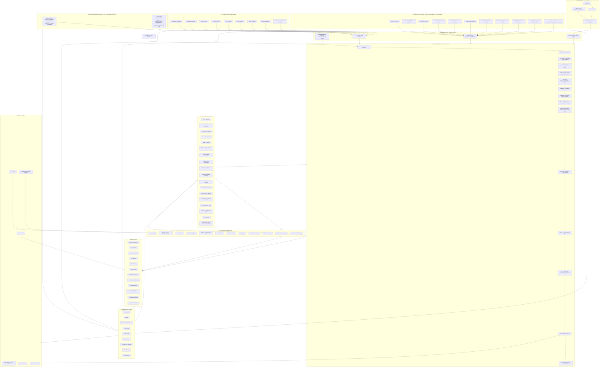

# Sourceborn ASI — Full Architecture Flow
## Human + Holy Books + AI + Worldwide Meta-AI/ASI Reference + Sourceborn Runtime

## What lands where

| Layer | Purpose | Sourceborn rule |
|---|---|---|
| Human | Human state, perception, memory, reasoning, values, social behaviour, learning and embodiment | Native Human IDs remain unchanged; activated by Sequence nodes/edges |
| Holy Books | Civilizational memory, scripture, narratives, law, ethics, values, symbols, promises, exceptions, actor views, observer/writer history, meaning | Source text, translation, commentary, interpretation and Sourceborn interpretation remain separate |
| AI | Machine capabilities, model behaviour, tools, memory/context, planning, multimodality, safety, learning and evaluation | AI native capability registry remains separate from Human |
| Worldwide Meta-AI | External comparison patterns for orchestration/governance | Reference only unless explicitly adopted |
| Worldwide ASI | External/hypothetical superintelligence capability concepts | Reference/falsifier/gap discovery, not Sourceborn truth |
| Universal Sequence | Runtime graph grammar | Chooses actual instance order; not a fixed 57-stage line |
| ASI Nodes | Persistent runtime services | Service order follows Sequence graph |
| Control Fabric | Enforces barriers, thresholds, views, evidence, gaps and version integrity | Always active |
| Memory | Stores traces, facts, paths, failures, rules, narratives, compression and closure packets | No anonymous memory; provenance/scope/version required |
| Synthesis | Cross-domain comparison and verified pattern formation | Contradictions remain visible |
| App | Human operator surface | Create/edit/link/version/validate without rewriting closed historical instances |

## Holy Books are not an optional decoration

The Holy Books layer is specifically prevented from collapsing into a generic "knowledge" field.

It can supply or challenge:
- narratives and event chains,
- actor views and knowledge distribution,
- promises and stored commitments,
- laws / rules / prohibitions / permissions,
- exception contracts,
- priority conflicts,
- moral/value structures,
- symbolic/metaphorical compression,
- civilizational memory and transmission,
- observer/writer distinctions,
- era/closure concepts,
- counterexamples and falsifiers,
- long-horizon patterns.

Every extracted item must retain source provenance and interpretation layer. Sourceborn may compare and reason over it, but must not silently label an interpretation as source fact.

## App corners

1. Dashboard — active Sequences, closures, blocked edges, gaps, contradictions.
2. Sequence Builder — graph editor, edge contracts, thresholds, sub-Sequences.
3. Human Registry — segments/containers/parameters/bindings.
4. Holy Books Registry — canon/source/commentary/interpretation/narrative/rule/principle bindings.
5. AI Registry — capability families, native hierarchy, tool/action/memory bindings.
6. Worldwide Reference — Meta-AI/ASI comparison library with source/evidence status.
7. Node Brain Manager — ASI Node services, permissions, inputs/outputs/local memory.
8. Memory Explorer — trace/path/failure/rule/narrative/closure/compression.
9. Evidence & Truth — claims, provenance, witness/source independence, proof debt.
10. Gap & Contradiction — unresolved dots, conflict pairs, investigation Sequences.
11. Seeds & Futures — latent results, commitments, activation thresholds.
12. Simulation/Test — Reverse -> Forward -> Reverse, counterfactual removal, repair/retest.
13. Pattern/Law Lab — compare closed cases; form candidate reusable rules.
14. Version/Migration — templates vs instances, IDs, rollback, audit.
15. Governance — human authority, permissions, overrides, exception contracts.
16. Reports/Exports — closure packets, graphs, ledgers, adoption packets.
